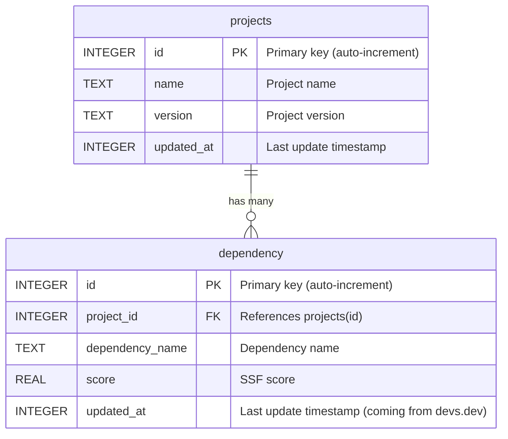
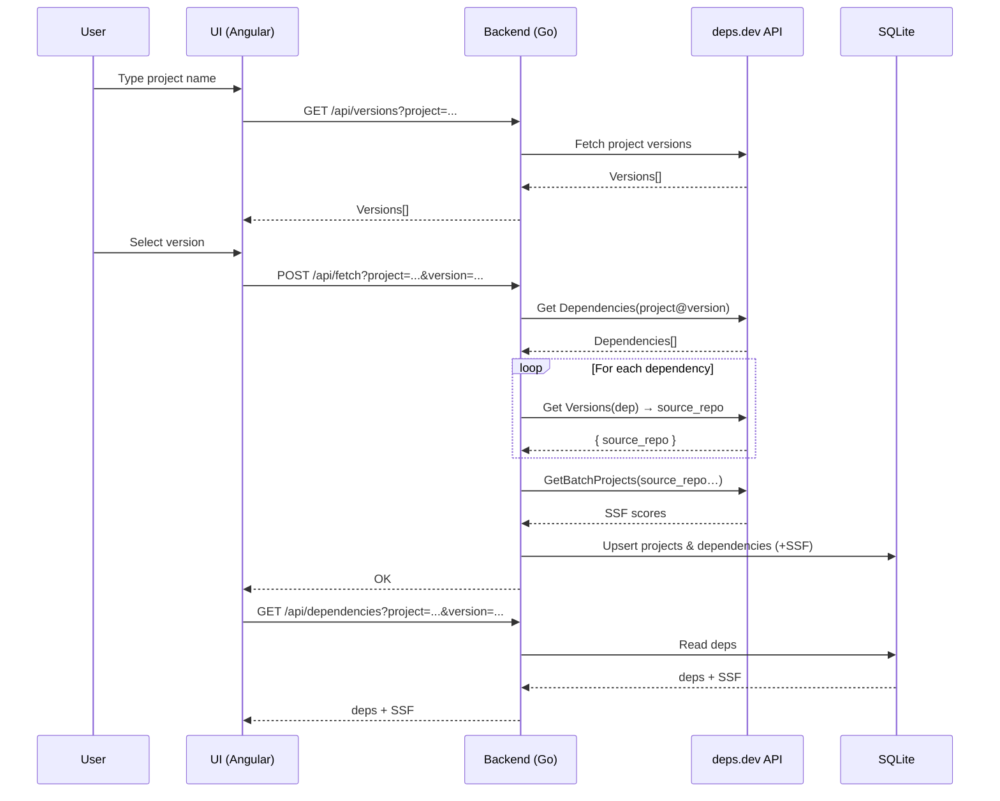

# DependencyManager

**DependencyManager** is a service for fetching **NPM project dependencies** from the [deps.dev](https://deps.dev) API, including their **OpenSSF Score**.  
All retrieved data is stored in an **SQLite** database.

The service also provides a **UI** for easily viewing and managing projects.  

---

## How to Run

To start the service:
```bash
./start.sh
```
To stop service:
```bash
./start.sh
```
---
## API docs


Please check 
``docs/swagger.yaml``

---
## Database structure



**Indexes:**  
- `UNIQUE(name, version)` on `projects`  
- `UNIQUE(project_id, dependency_name)` on `dependency`  
- `idx_dependency_project_name` → `(project_id, dependency_name)`  
- `idx_dependency_project` → `(project_id)`  
- `idx_dependency_project` → `(project_id)`
- `idx_dependency_score` → `(score)`
---

## Sequence diagram (detailed data flow)
I cannot find any API in deps.dev that returns both dependencies and their SSF score in a single request, so the flow works as follows:

1. First, the user needs to type the project name; we then fetch the available versions for it. If they choose one of them, the backend starts retrieving data.

2. We first fetch the dependencies for the project, then for each of those dependencies we fetch their versions to obtain the source_repo.

3. If the source_repo is available, we use the GetBatchProjects API to get project information, where we can find the SSF score.

4. If everything works correctly, we store the results in the database. If the user wants to update a dependency, they can use the fetchDependencies API, which repeats the previous steps and compares the output with the data stored in the database.

